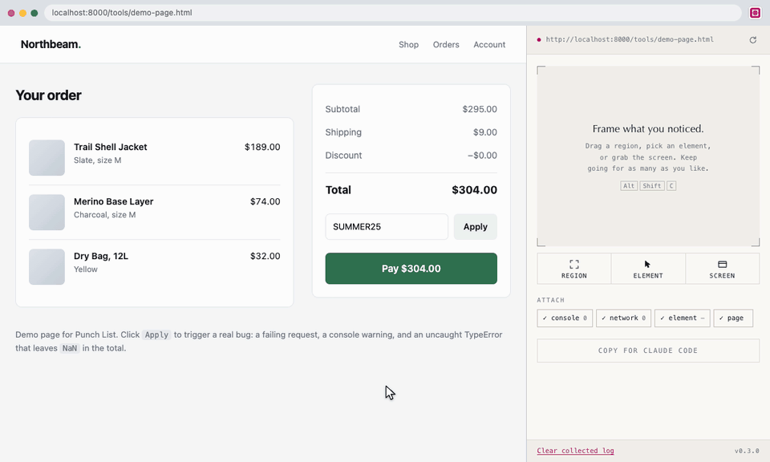
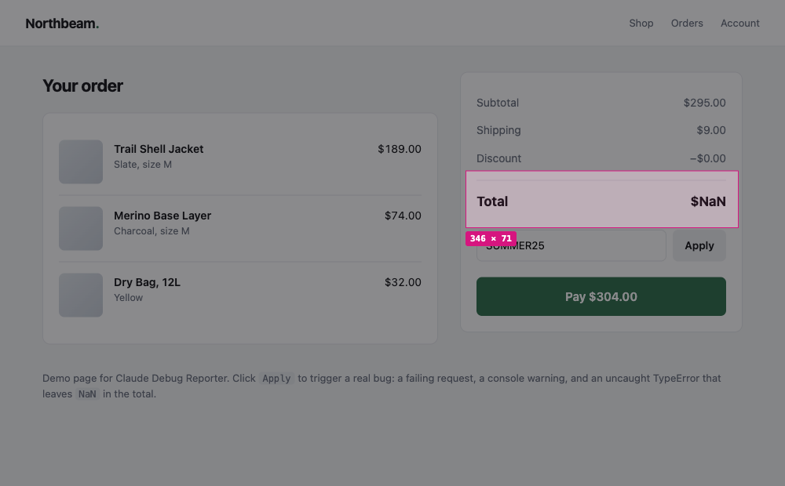
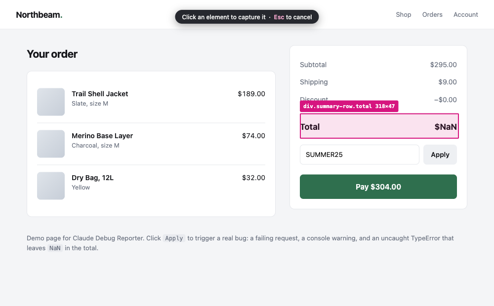
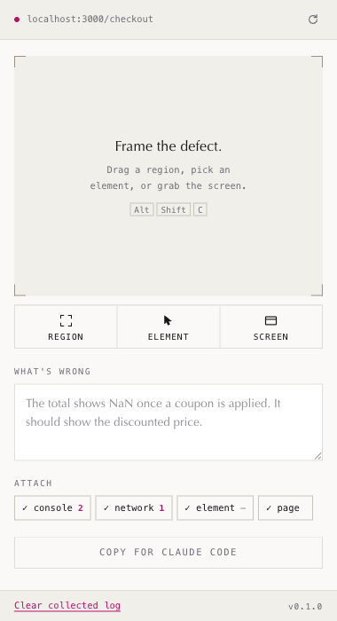
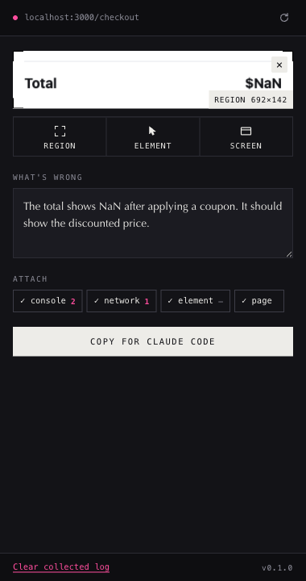

<div align="center">


# Claude Debug Reporter

**See a bug. Frame it. Paste it into Claude Code.**

A Chrome extension that captures the broken part of a page together with the console
errors and failed requests behind it, then hands Claude Code a single prompt containing
all of it.


</div>

<br>



<sub><i>A real capture of <code>tools/demo-page.html</code>, the demo page in this repository.</i></sub>

<br>

## Why

You spot something broken in the browser. To get Claude Code to fix it, you screenshot the
page, paste the image, type out the symptom, then remember that the stack trace lives in
DevTools and go back for it.

The screenshot is the part everyone remembers. The console output is the part that usually
gets skipped, and it is almost always the part that actually locates the bug.

This extension collects both without being asked, and gives you one thing to paste.

## How it works

### 1. Frame the defect

Drag a region, click a single element, or grab the whole viewport. Press <kbd>Esc</kbd> to
back out.

<table>
<tr>
<td width="50%"><br><sub><b>Region.</b> Drag a box around anything.</sub></td>
<td width="50%"><br><sub><b>Element.</b> Hover to highlight, click to pick.</sub></td>
</tr>
</table>

The element picker also reads that node's markup and its computed styles, so layout bugs
arrive with the CSS already attached.

### 2. Say what is wrong

One sentence is usually enough, because the console output travels with it.

<table>
<tr>
<td width="50%"></td>
<td width="50%"></td>
</tr>
</table>

The counts next to each toggle show what is actually available right now, so you can tell at
a glance whether the page has thrown anything.

### 3. Copy for Claude Code

The screenshot is written to `~/Downloads/claude-debug/` and a prompt containing its
absolute path lands on your clipboard. You paste once. Claude Code opens the image itself.

## Example: one bug, start to finish

This uses the demo page in this repository (`tools/demo-page.html`), which breaks on purpose,
so you can reproduce every line below yourself.

**What you see.** Click **Apply** on the coupon field and the order total turns into `$NaN`.

**What you cannot see.** The cause is two lines of that page's script, and no screenshot will
ever show them to you:

```js
const entry = CATALOG[code];        // undefined for any code outside CATALOG
const discount = 295 * entry.rate;  // throws, so the total is left holding NaN
```

**What you do.** Press <kbd>Alt</kbd><kbd>Shift</kbd><kbd>C</kbd>, drag a box over the total,
type one sentence, click **Copy for Claude Code**. Roughly five seconds.

**What lands on your clipboard.** Produced by the real template from a real capture of that
page, not written by hand:

````markdown
Fix this issue on http://localhost:8000/tools/demo-page.html

## What's wrong
The total shows NaN after applying a coupon. It should show the discounted price.

## Screenshot
/Users/you/Downloads/claude-debug/2026-08-08_11-13-13_localhost-demo-page.png

Read that image before anything else. It shows the problem as rendered.

## Page
- URL: http://localhost:8000/tools/demo-page.html
- Title: Checkout | Northbeam Supply
- Viewport: 1280 x 720 @2x
- Captured: 08/08/2026, 11:13:13

## Console output
```
[unhandled] TypeError: Cannot read properties of undefined (reading 'rate')
          at applyCoupon (http://localhost:8000/tools/demo-page.html:184:38)
[warn] Coupon SUMMER25 not found in catalog, falling back to local lookup
```

## Failed network requests
```
POST /api/coupons/validate -> 501 Unsupported method ('POST') (38ms)
```

---
Find the root cause in this codebase before changing anything. If the screenshot and
the console point at different things, say so rather than guessing.
````

Just under 1,000 characters, roughly 250 tokens.

**Why that beats a screenshot on its own.** The image proves the symptom is real and pins down
which element is wrong. Everything that actually locates the bug rides along with it: the file
and line that threw, the request that failed first and pushed the code down its fallback path,
and the warning naming the coupon that was missing. Claude Code never has to ask you to open
DevTools and paste the error.

That capture used **Region**. Choosing **Element** instead adds one more section, carrying the
node's markup, a selector that finds it again, and its computed styles:

```
## Selected element
Selector: `main > aside.card.cart-summary > div.summary-row.total:nth-of-type(4)`
<div class="summary-row total">
  <span>Total</span><span class="amount total-amount" id="total">$NaN</span>
</div>
Computed styles: display: flex; width: 318px; height: 47.3438px; padding: 13px 0px 7px; margin: 10px 0px 0px; box-sizing: border-box; justify-content: space-between; color: rgb(22, 23, 27); font-family: ui-sans-serif, system-ui, -apple-system, "Segoe UI", sans-serif; font-size: 17px; font-weight: 700; line-height: 26.35px
```

That style list is twelve properties out of the roughly 340 `getComputedStyle` returns.
Properties still sitting at their initial value are dropped automatically, so nothing here is
`opacity: 1` filler. If `font-family` and a fractional `height` are not what you debug, the
list is one array to edit.

The prompt wording lives in one file and is likewise meant to be edited. See
[Make it yours](#make-it-yours).

## Install

### From a release

1. Download `claude-debug-reporter-vX.Y.Z.zip` from the [releases page](../../releases).
2. Unzip it.
3. Open `chrome://extensions` and turn on **Developer mode**.
4. Click **Load unpacked** and select the unzipped folder.
5. Pin the extension, then reload any tab you want to debug.

### From source

```bash
git clone https://github.com/srdjanmitrovic/claude-debug-reporter.git
cd claude-debug-reporter
```

Then follow steps 3 to 5 above, selecting the repository folder itself. There is nothing to
install and nothing to compile.

Requires Chrome 116 or newer.

> **That last step matters.** Console and network capture works by wrapping `console.error`,
> `fetch` and `XMLHttpRequest` before the page's own scripts run, which can only happen on a
> page load that occurs after the extension is enabled. On a tab opened earlier, screenshots
> still work, but the context counts show a dash and the panel tells you to reload.

## Try it in one minute

The repository ships a demo page that breaks on purpose.

```bash
python3 -m http.server 8000
```

Open `http://localhost:8000/tools/demo-page.html`, press <kbd>Alt</kbd><kbd>Shift</kbd><kbd>C</kbd>,
and drag a box over the total. Now click **Apply** on the page: it fires a failing request, a
console warning, and an uncaught `TypeError` that leaves `NaN` in the total. Capture again and
watch the counts fill in.

## What gets attached

| Toggle | What it adds |
| :--- | :--- |
| **console** | `console.error` and `console.warn` calls, uncaught exceptions with stack frames, unhandled promise rejections, and failed resource loads |
| **network** | Requests that returned 4xx or 5xx or failed outright, with method, URL, status and timing |
| **element** | The picked node's markup, a CSS selector that finds it again, and a curated set of computed styles |
| **page** | URL, title, viewport size and device pixel ratio |

Each toggle is remembered between sessions. So is whatever you had typed.

## Privacy

Nothing leaves your machine. There is no network code in this extension: screenshots go to
your Downloads folder and text goes to your clipboard.

The one caveat worth stating plainly is that the collector has to run in the page's own
JavaScript world to wrap the real `console` and `fetch`, and anything in that world is
reachable by the page. Scripts on the page can therefore request the collected buffer. In
practice that buffer holds the page's own console and network activity, which any script
there could already record by wrapping the same functions, so nothing becomes newly
available. It does mean the buffer is not a private channel.

`clipboardWrite` is deliberately **not** requested. Chrome allows sanitized clipboard writes
from extension pages without it, so asking would add the "Modify data you copy and paste"
install warning while buying nothing.

### Restricting it to your own sites

`<all_urls>` appears in `manifest.json` **three** times, and they are separate grants that do
different jobs. Narrowing one and not the others is the mistake to avoid, because each half
fails quietly in its own way.

| Where | What it controls |
| :--- | :--- |
| `host_permissions` | Screenshotting the tab, injecting the overlay and picker, and whether Chrome reveals the tab's URL to the extension at all |
| `content_scripts[].matches`, twice | Where the collector arms, and therefore which sites `console`, `fetch` and `XMLHttpRequest` get wrapped on. This is also what drives the site list in the install warning. |

To limit the extension to the sites you actually debug, change **all three** to the same list:

```json
"host_permissions": ["http://localhost/*", "https://*.yourcompany.com/*"],

"content_scripts": [
  { "matches": ["http://localhost/*", "https://*.yourcompany.com/*"], "js": ["content/collector-bridge.js"], "world": "ISOLATED", "run_at": "document_start" },
  { "matches": ["http://localhost/*", "https://*.yourcompany.com/*"], "js": ["content/collector-main.js"], "world": "MAIN", "run_at": "document_start" }
]
```

Editing only `host_permissions` leaves the collector still injecting on every page you visit
and still wrapping `console`, `fetch` and `XMLHttpRequest` there, which is usually the exact
thing you were trying to stop. Editing only `matches` leaves capture working nowhere, since
Chrome withholds the URL and the panel reports the page as unreadable.

[Permissions are explained one by one in the architecture notes](docs/ARCHITECTURE.md#permissions).

## Make it yours

**The prompt.** [`shared/prompt-template.js`](shared/prompt-template.js) is the whole contract
with Claude Code, and it is the most useful file to edit. Ordering, tone, and how firmly it
instructs are all yours to set. To see your changes without reloading anything:

```bash
npm run prompt
```

That renders the real template against a representative report and prints exactly what would
land on your clipboard, plus a rough token count.

**Which computed styles get reported.** `STYLE_PROPERTIES` at the top of
[`content/picker.js`](content/picker.js). It is a shortlist because `getComputedStyle` returns
around 340 properties and dumping them all buries the signal.

**Where screenshots go.** `SAVE_FOLDER` in [`sidepanel/panel.js`](sidepanel/panel.js), relative
to your Downloads directory.

**How much history the collector keeps.** `LIMIT` in
[`content/collector-main.js`](content/collector-main.js), currently the last 30 entries per
category.

## Development

There is no build step. Edit a file, then press reload on the extension card in
`chrome://extensions`. Content script changes also need a page reload. Side panel changes need
the panel closed and reopened.

```bash
npm run build     # package dist/claude-debug-reporter-vX.Y.Z.zip for a release
npm run prompt    # preview the prompt template with sample data
npm run icons     # regenerate the PNG icons from tools/make-icons.py
```

`npm run build` needs no `npm install`. There are no dependencies: the packager writes the zip
itself so it behaves identically on macOS, Linux and Windows, and produces a byte identical
archive for the same input so release checksums are reproducible.

[How the pieces fit together](docs/ARCHITECTURE.md), including why the collector is split in
two and why the heavy lifting lives in the side panel rather than the service worker.

## Roadmap

Honest about what is not built yet.

* **Full page screenshots** that scroll and stitch. Sticky headers repeat, lazily loaded
  content shifts under you, and the capture rate limit forces roughly half a second per
  viewport. Region capture covers most real cases.
* **Framework component names.** Reading a React fiber or Vue instance off a DOM node needs
  main world access, which the collector already has. Wiring the picker through it would let
  the prompt name the component instead of only the selector. This is the most valuable thing
  left on the list.
* **Recording a sequence** rather than a single moment.

## Contributing

Issues and pull requests are welcome. [Start here](CONTRIBUTING.md).

If you are reporting a bug in this extension, the extension can report it for you.

## License

MIT. See [LICENSE](LICENSE).

<div align="center">
<br>
<sub>Not affiliated with Anthropic. Claude and Claude Code are products of Anthropic.</sub>
</div>
